# 🏗️ Clean Architecture — Aim Trainer

Documentación completa de la arquitectura del Aim Trainer implementado con Python y Pygame, siguiendo principios **SOLID**, **Clean Architecture** y **Domain-Driven Design**.

---

## 📐 Diagrama de Capas (Clean Architecture)

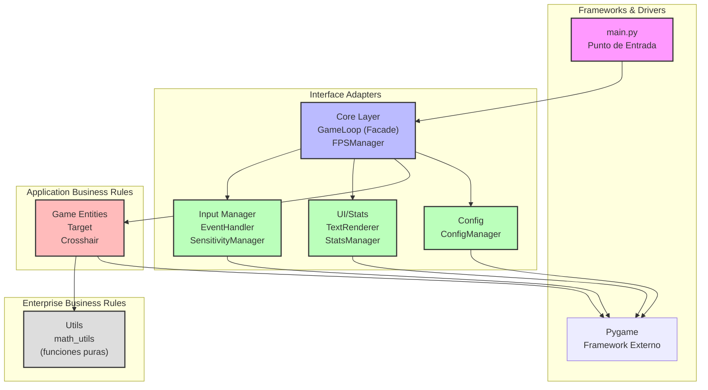

**Regla de dependencia:** Las dependencias apuntan hacia adentro. Las capas externas dependen de las internas, nunca al revés.

---

## 🔄 Diagrama de Flujo del Bucle Principal

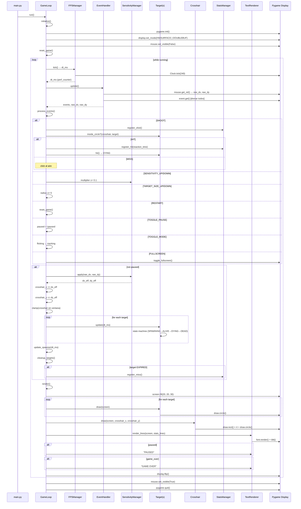

---

## 🧩 Diagrama de Clases (UML Simplificado)

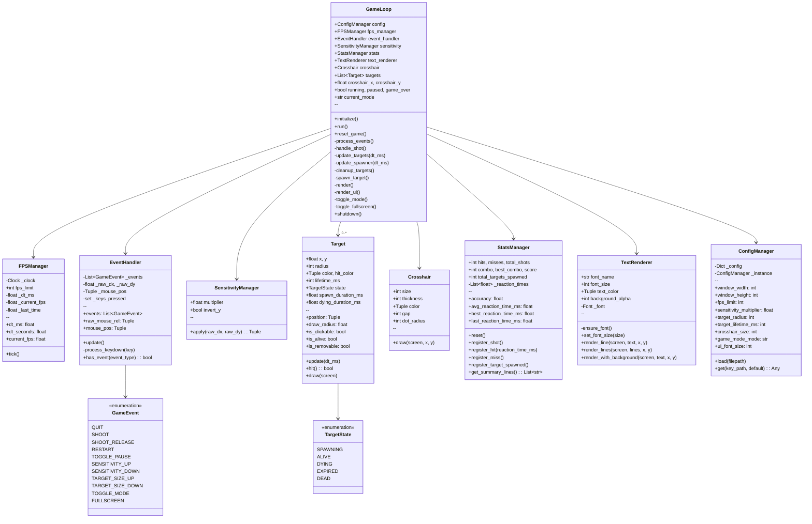

---

## 🔁 Máquina de Estados del Target

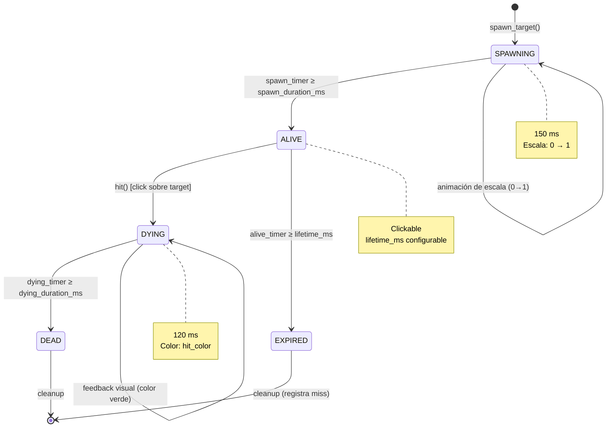

---

## 📊 Diagrama de Flujo de Datos

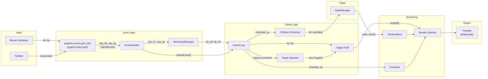

---

## 📦 Diagrama de Paquetes (Dependencias)

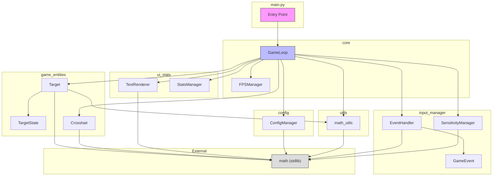

---

## 🎯 Principios SOLID Aplicados

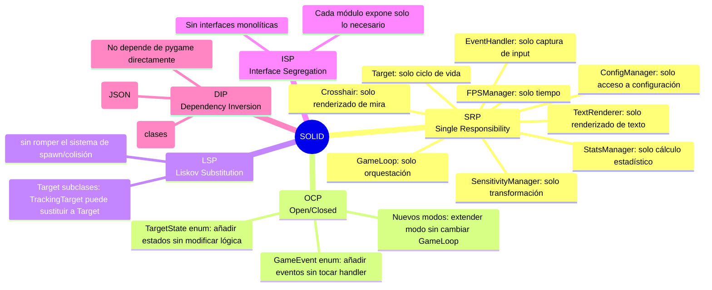

---

## ⚡ Estrategia Anti Input Lag

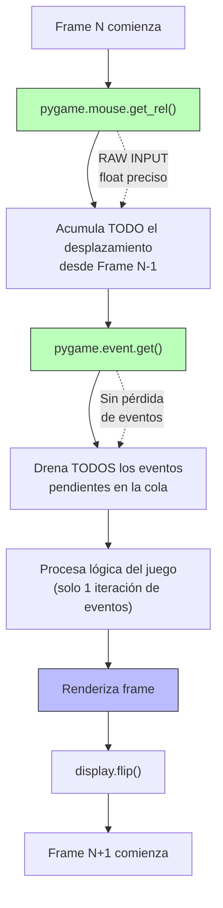

---

## 📐 Vistas de Arquitectura (4+1 Views)

### Vista Lógica

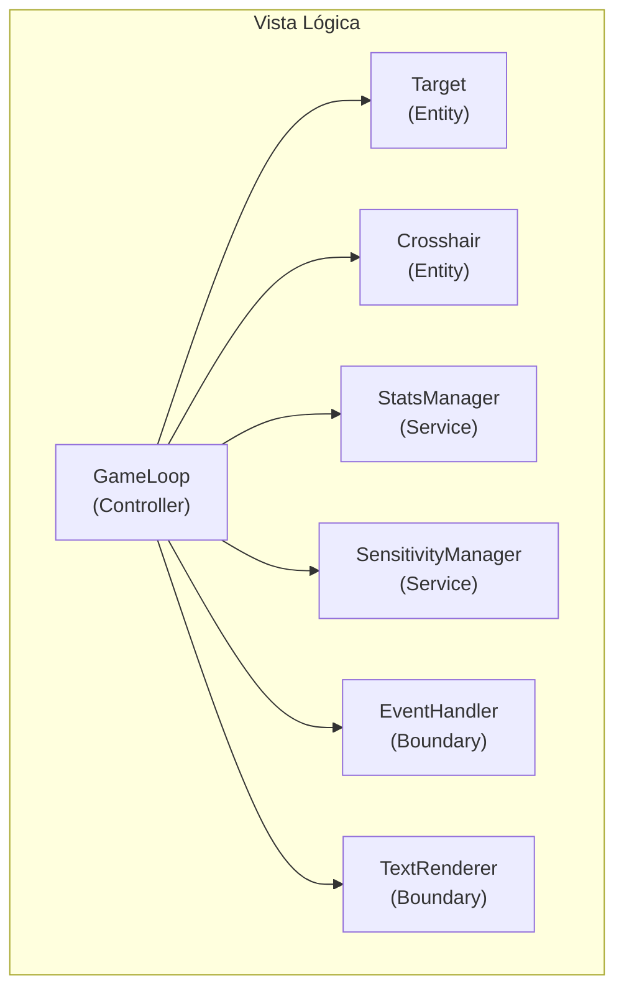

### Vista de Procesos

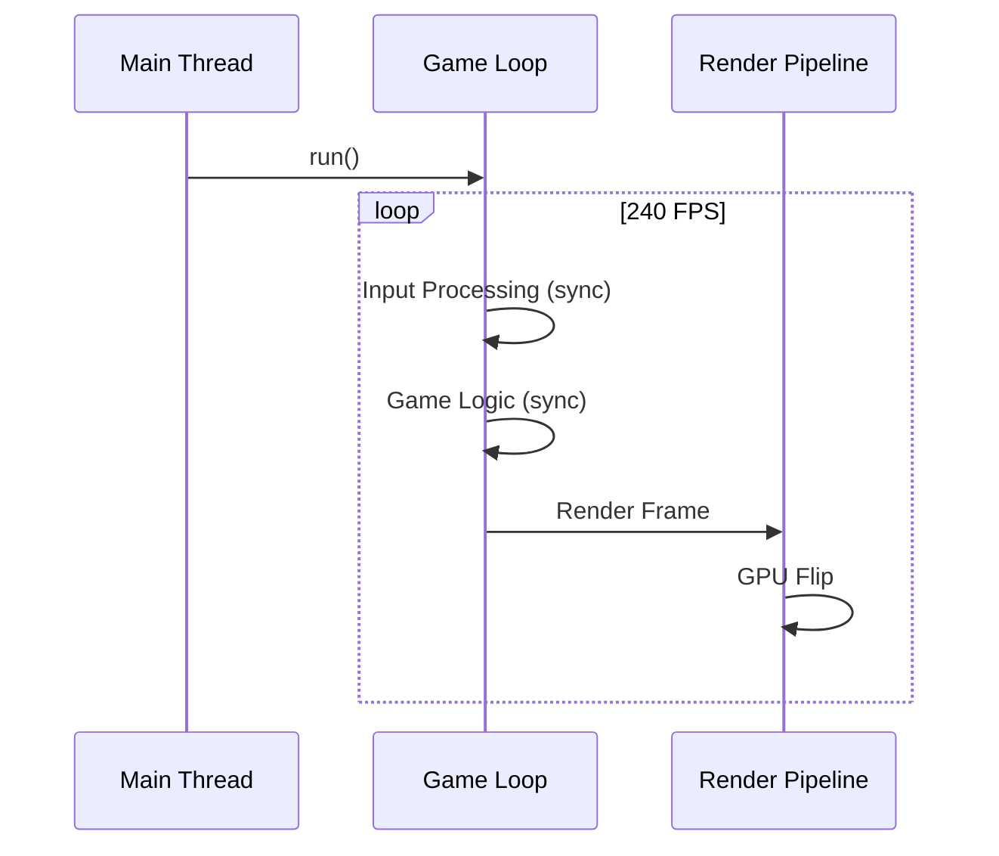

### Vista de Desarrollo

```
core/           ← Capa de aplicación
input_manager/  ← Adaptadores de entrada
game_entities/  ← Entidades de dominio
ui_stats/       ← Adaptadores de salida
config/         ← Configuración
utils/          ← Utilidades compartidas
```

### Vista Física

```
┌──────────────────────────────────┐
│  PC del Usuario                  │
│  ┌────────────────────────────┐  │
│  │  main.py                   │  │
│  │  ┌──────────────────────┐  │  │
│  │  │  Python 3.11         │  │  │
│  │  │  ┌────────────────┐  │  │  │
│  │  │  │  Pygame 2.6    │  │  │  │
│  │  │  │  ┌──────────┐  │  │  │  │
│  │  │  │  │  SDL 2   │  │  │  │  │
│  │  │  │  │  GPU     │  │  │  │  │
│  │  │  │  └──────────┘  │  │  │  │
│  │  │  └────────────────┘  │  │  │
│  │  └──────────────────────┘  │  │
│  └────────────────────────────┘  │
│  ┌────────────────────────────┐  │
│  │  resources/config.json    │  │
│  └────────────────────────────┘  │
└──────────────────────────────────┘
```

### Vista de Escenarios (Casos de Uso)

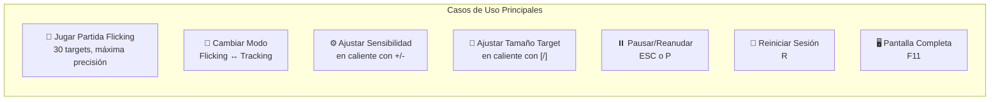

---

## 📊 Resumen de Métricas de Código

| Métrica | Valor |
|---|---|
| **Módulos** | 6 paquetes |
| **Archivos Python** | 13 |
| **Clases** | 8 principales |
| **Enums** | 2 (TargetState, GameEvent) |
| **Funciones puras** | 3 (utils) |
| **Líneas totales** | ~900 |
| **Dependencia externa** | Solo Pygame |
| **Archivos de configuración** | 1 JSON |
| **Documentación** | 2 Markdown |
